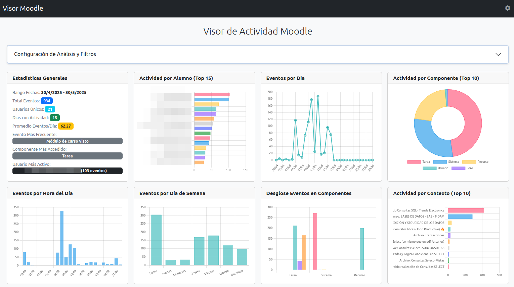
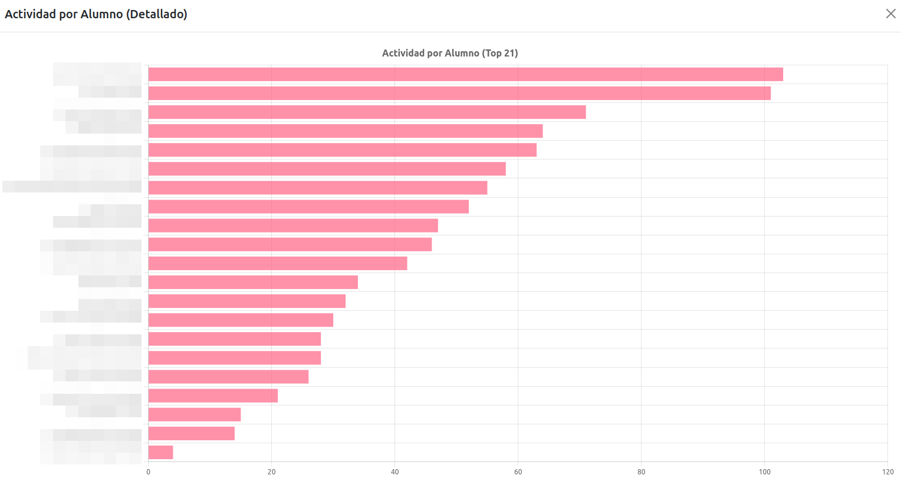

# Visor de Actividad Moodle 📊

Un visor interactivo, del lado del cliente, para los registros de actividad de Moodle. ¡Analiza fácilmente las exportaciones de logs CSV de Moodle directamente en tu navegador sin necesidad de configuración en el servidor! 🚀

Esta herramienta permite a educadores, administradores y usuarios de Moodle visualizar y filtrar rápidamente la actividad de los alumnos. Es completamente **autocontenida** en un único archivo HTML, lo que significa que no hay instalaciones complejas ni dependencias de servidor. ¡Simplemente ábrelo y úsalo! 🎉

## ✨ Características Principales

*   **📁 Carga Directa de CSV:** Procesa archivos CSV de logs de Moodle directamente desde tu ordenador.
*   **📈 Paneles Interactivos (Dashboards):** Un conjunto de gráficos para visualizar datos:
    *   Actividad por Alumno (Top N)
    *   Eventos a lo Largo del Tiempo
    *   Actividad por Componente (Top N)
    *   Actividad por Hora del Día
    *   Actividad por Día de la Semana
    *   Desglose de Eventos en Componentes Principales
    *   Actividad por Contexto del Evento (Top N)
*   **🔍 Filtrado Potente:**
    *   📅 **Rango de Fechas:** Enfócate en periodos específicos.
    *   👤 **Usuario:** Analiza la actividad de todos los usuarios o de un solo alumno.
    *   🏷️ **Nombre del Evento:** Aísla acciones particulares de Moodle (ej: "Módulo del curso visto", "Usuario matriculado en el curso").
    *   🧩 **Componente:** Profundiza en áreas específicas de Moodle (ej: Foro, Cuestionario, Tarea, Sistema).
    *   🌍 **Contexto del Evento:** Filtra por el curso, actividad o área del sistema específica donde ocurrió el evento.
*   **🚫 Exclusión de Usuarios:** Excluye fácilmente nombres de usuario específicos (ej: cuentas de prueba, administradores) del análisis para obtener datos más limpios.
*   **🖱️ Gráficos Clicables:** Amplía los gráficos del panel principal a una vista modal a pantalla completa para una inspección detallada.
*   **📄 Tabla Detallada de Logs:** Visualiza y desplázate por las entradas de log filtradas en crudo.
*   **🚀 Completamente del Lado del Cliente:** Todo el procesamiento ocurre en tu navegador, asegurando la privacidad de los datos y sin carga para el servidor.
*   **📱 Diseño Responsivo:** Se adapta a ordenadores de escritorio, tabletas y dispositivos móviles.
*   **⚙️ Persistencia de Configuración:** Los ajustes de exclusión de usuarios se guardan localmente en tu navegador.

## 📸 Capturas de Pantalla

<table align="center">
  <tr>
    <td align="center"><strong>Panel Principal y Gráficos</strong></td>
    <td align="center"><strong>Panel de Filtros y Tabla Detallada</strong></td>
  </tr>
  <tr>
    <td align="center"></td>
    <td align="center"></td>
  </tr>
</table>
*(Por favor, reemplaza estas con capturas reales llamadas `screenshot1.png` y `screenshot2.png` dentro de una carpeta `images` en tu repositorio.)*

## 🚀 Demo en Vivo en GitHub Pages

Prueba el Visor de Actividad Moodle en vivo:
[https://soyunomas.github.io/moodle-activity-viewer/](https://soyunomas.github.io/moodle-activity-viewer/)
*(Este enlace asume que tu nombre de usuario de GitHub es `soyunomas` y el nombre del repositorio es `moodle-activity-viewer`)*

## 📋 Cómo Exportar Logs de Moodle como CSV

Para usar este visor, primero necesitarás exportar los logs relevantes desde tu instancia de Moodle. Los pasos exactos pueden variar ligeramente dependiendo de tu versión de Moodle y tema, pero aquí tienes una guía general:

1.  **Inicia sesión en Moodle:** Accede a tu sitio Moodle con una cuenta de administrador o un rol de usuario que tenga permiso para ver los logs del sitio (ej: gestor).
2.  **Navega a Administración del Sitio:**
    *   Normalmente se encuentra en el bloque de navegación principal o en el menú de usuario.
3.  **Encuentra los Logs:**
    *   Ve a **Administración del sitio** -> **Informes** -> **Registros** (o "Logs").
    *   Alternativamente, podrías encontrar "Registros activos" (o "Live logs") y luego una opción para ver "Registro estándar" (o "Standard log") o "Todos los registros".
4.  **Aplica Filtros Iniciales (Opcional pero Recomendado):**
    *   **Curso:** Selecciona "Todos los cursos" o un curso específico.
    *   **Participantes:** Selecciona "Todos los participantes" (puedes filtrar usuarios en este visor).
    *   **Días:** Selecciona "Todos los días" o un rango de fechas amplio (puedes refinar fechas en este visor).
    *   **Actividades:** Selecciona "Todas las actividades".
    *   **Acciones:** Selecciona "Todas las acciones".
    *   **Tipo de Registro:** Asegúrate de que "Registro estándar" (o similar, no "Registro heredado" si es una opción) esté seleccionado.
5.  **Obtén los Logs:** Haz clic en el botón "Conseguir estos registros" (o similar).
6.  **Descarga como CSV:**
    *   Desplázate hasta la parte inferior de la página del informe de logs.
    *   Busca una sección "Descargar datos de la tabla como" o "Exportar".
    *   Elige **"Valores separados por comas (.csv)"** y descarga el archivo.

**➡️ Columnas CSV Importantes:**
Este visor depende de encabezados de columna específicos de la exportación CSV de Moodle. Los encabezados esperados por defecto (en español, según tu HTML) son:
*   `Hora`
*   `Nombre completo del usuario`
*   `Contexto del evento`
*   `Componente`
*   `Nombre evento`
*   `Descripción`

Si tu exportación de Moodle usa nombres diferentes, necesitarás actualizar el objeto `CSV_COLUMN_MAPPING` dentro de la etiqueta `<script>` en el archivo `index.html`.

## 💻 Cómo Usar el Visor

1.  **Abre `index.html`:**
    *   Descarga el repositorio y abre `index.html` directamente en tu navegador web.
    *   O visita la [Demo en Vivo](#-demo-en-vivo-en-github-pages).
2.  **Selecciona el Archivo CSV:**
    *   Bajo "1. Selecciona el archivo CSV:", haz clic en "Seleccionar archivo" y elige el archivo de log CSV que descargaste de Moodle.
3.  **Aplica Filtros (Opcional):**
    *   El acordeón "Configuración de Análisis y Filtros" está abierto por defecto.
    *   Ajusta la **Fecha de Inicio** y **Fecha de Fin**.
    *   Usa los menús desplegables para filtrar por **Alumno**, **Nombre Evento**, **Componente** o **Contexto del Evento** específico.
4.  **Analiza:**
    *   Haz clic en el botón **"Analizar Logs"**.
5.  **Explora los Resultados:**
    *   Visualiza las estadísticas resumidas y los gráficos interactivos en el panel.
    *   Haz clic en cualquier tarjeta de gráfico pequeña para ver una versión ampliada en un modal.
    *   Desplázate por la tabla "Detalle de Logs Filtrados" en la parte inferior.
6.  **Configura Exclusiones (Opcional):**
    *   Haz clic en el icono de engranaje (⚙️) en la barra de navegación superior.
    *   Introduce subcadenas de nombres de usuario separadas por comas para excluir (ej: "usuario de prueba, admin, soporte").
    *   Haz clic en "Guardar Cambios y Reanalizar". Las exclusiones se guardan en el almacenamiento local de tu navegador.

## 🛠️ Construido Con

*   **HTML5:** Marcado semántico.
*   **CSS3:** Estilos personalizados y diseño responsivo.
*   **Bootstrap 5:** Para componentes de UI, maquetación y responsividad.
*   **JavaScript (ES6+):** Toda la lógica del lado del cliente, parseo de datos y manipulación del DOM.
*   **Chart.js:** Para crear gráficos interactivos y atractivos.
*   **date-fns:** Para un parseo y manipulación de fechas robusto.

## 📝 TO-DO / Mejoras Futuras

*   [ ] **Exportar Informe Completo:** Opción para descargar la vista actual del panel (quizás como PDF o una colección de imágenes y resúmenes de datos). 📥
*   [ ] **Selección Avanzada de Columnas:** Permitir a los usuarios mapear columnas CSV si su exportación tiene encabezados diferentes, directamente desde la UI.
*   [ ] **Filtrado de Tiempo Más Granular:** Añadir filtros por hora del día (ej: mostrar actividad solo entre las 9 AM y las 5 PM). ⏱️
*   [ ] **Guardar/Cargar Configuraciones de Filtro:** Permitir a los usuarios guardar un conjunto completo de filtros aplicados (fechas, usuario, evento, etc.) y recargarlos más tarde.
*   [ ] **Accesibilidad Mejorada (A11Y):** Revisar y mejorar aún más los atributos ARIA y la navegación por teclado para todos los componentes. ♿
*   [ ] **Temas/Personalización:** Opciones básicas para que los usuarios cambien los colores de los gráficos o un tema claro/oscuro para el visor. 🎨
*   [ ] **Análisis de Rendimiento:** Probar con archivos CSV extremadamente grandes y optimizar el parseo/renderizado si se encuentran cuellos de botella (ej: considerar Web Workers para el parseo).

## 📜 Licencia

Este proyecto está licenciado bajo la Licencia MIT. Consulta el archivo [LICENSE.md](LICENSE.md) para más detalles.

---

¡Feliz análisis de logs de Moodle! Si encuentras útil esta herramienta, ¡considera marcar el repositorio con una estrella! ⭐
